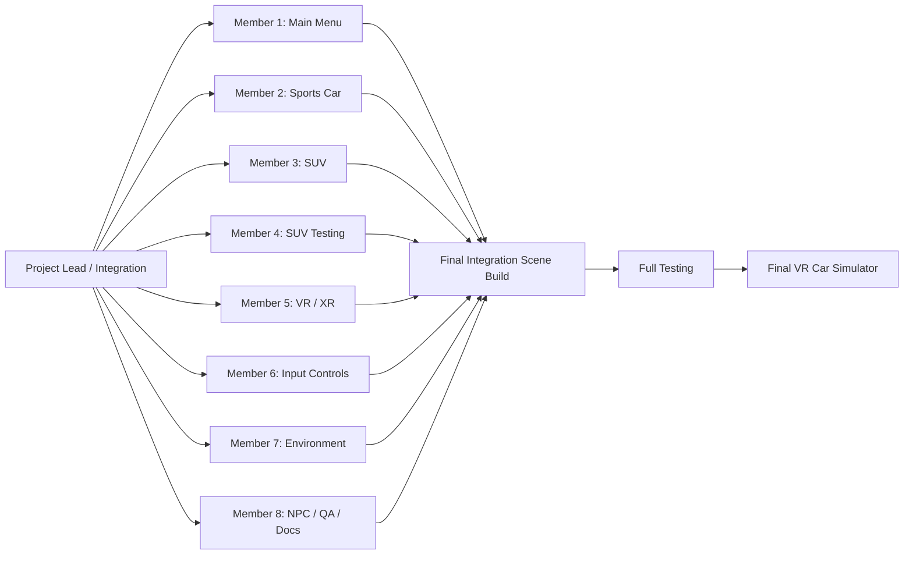
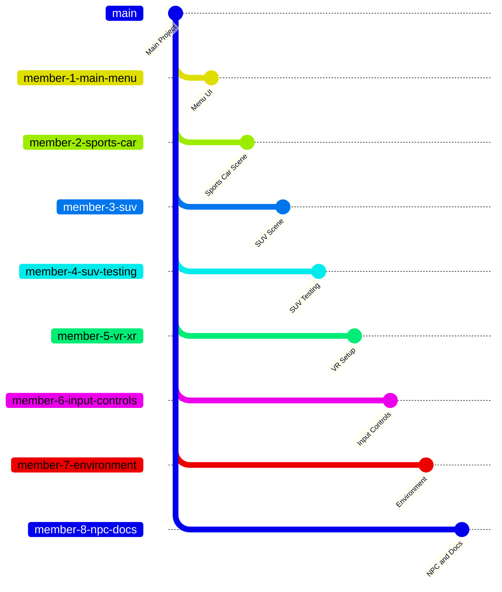

# Car Simulator VR - Project Hierarchy

This structure is designed for an 8-member team where each member owns one clear scenario or project area.

## 1. Main Project Graph

```mermaid
flowchart TD
    A["Car Simulator VR Project"] --> B["Scenes"]
    A --> C["Vehicles"]
    A --> D["VR / XR System"]
    A --> E["Input System"]
    A --> F["Environment"]
    A --> G["NPC / Characters"]
    A --> H["UI / Menu"]
    A --> I["Testing and Documentation"]

    B --> B1["Main Menu Scene"]
    B --> B2["Sports Car Scene"]
    B --> B3["SUV Scene"]
    B --> B4["SUV Testing Scene"]

    C --> C1["Sport Coupe Prefab"]
    C --> C2["Pickup Prefab"]
    C --> C3["Vehicle Physics Pro"]

    D --> D1["OpenXR"]
    D --> D2["Meta Quest Support"]
    D --> D3["XR Interaction Toolkit"]
    D --> D4["XR Device Simulator"]

    E --> E1["Keyboard Input"]
    E --> E2["Steering Wheel Input"]
    E --> E3["Pedals / Brake / Throttle"]
    E --> E4["WheelKeyboardVPPInput.cs"]

    F --> F1["Playground 1000x1000"]
    F --> F2["Road / Driving Area"]
    F --> F3["Lighting and Performance"]

    G --> G1["NPC Models"]
    G --> G2["NPC Materials"]
    G --> G3["NPC Prefabs"]

    H --> H1["Start Game"]
    H --> H2["Scene Selection"]
    H --> H3["Settings"]

    I --> I1["VR Testing"]
    I --> I2["Controller Testing"]
    I --> I3["Screenshots"]
    I --> I4["README / Report"]
```



## 2. Team Member Scenario Ownership

| Team Member | Main Responsibility | Scene / Folder Area | Expected Output |
|---|---|---|---|
| Member 1 | Main Menu Scenario | `Assets/Scenes/Main Menu.unity` | Start screen, scene navigation, basic UI |
| Member 2 | Sports Car Scenario | `Assets/Scenes/Sports Car.unity` | Sports car driving scene with working vehicle behavior |
| Member 3 | SUV Scenario | `Assets/Scenes/SUV.unity` | SUV driving scene with camera and driving setup |
| Member 4 | SUV Testing Scenario | `Assets/Scenes/SUV testing.unity` | Test version for tuning physics, controls, and bugs |
| Member 5 | VR / XR Scenario | `Assets/XR`, `Assets/XRI`, `ProjectSettings/XR*` | Meta Quest / OpenXR setup and VR camera experience |
| Member 6 | Input Control Scenario | `Assets/Scripts/WheelKeyboardVPPInput.cs`, `Assets/last.inputactions` | Keyboard, steering wheel, throttle, brake, and ignition controls |
| Member 7 | Environment Scenario | `Assets/New Assets for main scene` | Playground, road space, camera prefabs, scene objects |
| Member 8 | NPC, Assets, QA, and Documentation | `Assets/npc_casual_set_00`, `Assets/Images`, `README.md` | NPC integration, screenshots, testing notes, final documentation |

## 3. Team Workflow Graph



## 4. Recommended Unity Folder Structure

```text
Assets/
  Scenes/
    Main Menu.unity
    Sports Car.unity
    SUV.unity
    SUV testing.unity

  Scripts/
    WheelKeyboardVPPInput.cs

  New Assets for main scene/
    Main Camera.prefab
    Playground 1000x1000.prefab
    VPP JPickup.prefab
    VPP Sport Coupe.prefab

  XR/
    Loaders/
    Settings/
    XRGeneralSettingsPerBuildTarget.asset

  XRI/
    Settings/
      Resources/
        XRDeviceSimulatorSettings.asset
        InteractionLayerSettings.asset

  npc_casual_set_00/
    Mesh/
    Materials/
    Prefabs/
    Textures/

  Images/
    Screenshots and project images

Packages/
  manifest.json
  packages-lock.json

ProjectSettings/
  InputManager.asset
  XRPackageSettings.asset
  ProjectSettings.asset
  QualitySettings.asset
```

## 5. Individual Scenario Branch Plan

Each team member should work on a separate branch or separate scene copy, then merge after testing.



## 6. Simple Presentation Version

```text
Car Simulator VR
|
|-- Member 1: Main Menu
|-- Member 2: Sports Car Scenario
|-- Member 3: SUV Scenario
|-- Member 4: SUV Testing Scenario
|-- Member 5: VR / XR Setup
|-- Member 6: Steering Wheel and Keyboard Controls
|-- Member 7: Environment and Playground
|-- Member 8: NPC Assets, Screenshots, QA, Documentation
|
Final Integration
|
Final VR Car Simulator Build
```

## 7. Integration Rule

Before final integration, each member should provide:

1. Their updated Unity scene or folder.
2. A short test note explaining what works.
3. Screenshots or screen recording if the change is visual.
4. Any known issue that still needs fixing.

